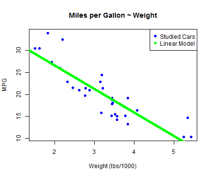

## Learning Data Science

Science is how we attempt to understand and manipulate the world around us. There is always data, relations, questions, algorithms and insight. Take for example a set of cars.

 

You can see how the car weight influences it's miles per gallon performance. Data analysis can help you understand further! **But first you must learn theory and practice!**

--- .class #id  &twocol w1:40% w2:60%

## Learning Experience MATTERS!

Consider a class on linear models

$$\Large Y = \sum_{i=1}^{n}{\beta_iX_i}$$

They are very interesting, but the learning experience depends on the resources available to the student, the professor or mentor and the learning traits.

*** {name: left}
### Offline Class

- Face to face with professor and peers
- Questions solved on the spot
- Lots of **Guided Manual Exercises**
- **Immediate feedback**
- Student mistakes are corrected immediatly

*** {name: right}
### Online Class
- Massive **online resources**
- Flexible class schedules (learn at your pace)
- Student is **free to explore**
- Feedback has a delay
- Errors or mispractice is not identified quickly

--- .class #id

## Our Idea Pitch

Inspired by resources like `manipulate` and `swirl` R packages and [W3Schools](http://www.w3schools.com/), we at IP believe that under a controlled scenario a student can learn in an app that merges exercises with scenario exploration, explanations and data interpretation.

Take a moment to visit our [first webapp](https://csmc88.shinyapps.io/shinyClass). It is both a class and a guided exercise on the topic of extrapolating with linear models. 


```r
data(mtcars)
fit <- lm(mpg ~ wt, mtcars)
summary(fit)$coefficients
```

```
##             Estimate Std. Error t value  Pr(>|t|)
## (Intercept)   37.285     1.8776  19.858 8.242e-19
## wt            -5.344     0.5591  -9.559 1.294e-10
```

Simple OLS is easy to understand, but it is far more educative to study it by playing with data and a mentor close by.

--- .class #id &checkbox

## Think of the possibilities

Our first app might seem a little raw and incomplete. But the *IDEA* can be taken further as an additional resource for online courses or a class all in itself. 

With additional work, the app can even teach R programming! Through interactive plots and controlled R code these **online guided experiments** can help a student learn the development and modeling concepts of data science.

### What do you think?   
1. _I want to give feedback on this_
2. _New teaching resources are always welcome_
3. _This should be done carefully_
4. This won't work

*** .hint
Don't be negative, try new things and fail quickly to learn faster. 
*** .explanation
Thank you! We believe in open ideas developed with care and teamwork!.  
